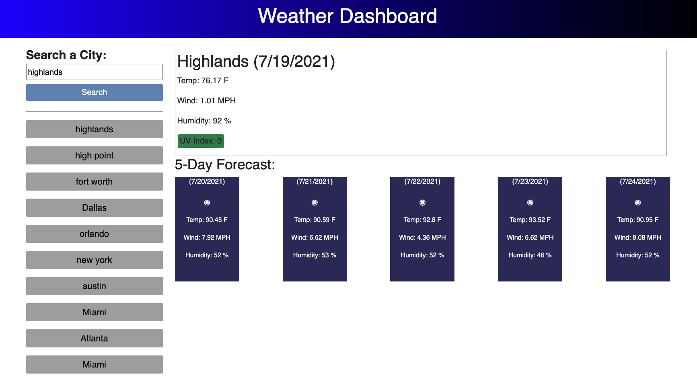

# Weather_App

# Descrition

Weather dashboard that allows users to input a city name and see current weather along with a 5 day forecast. All recent searches are saved under searchbar and will populate page with data when clicked on for quick access to users when wanting to go back to view a prior searched city.

# Technologies Used

* jQuery
* Bootstrap
* API: [OpenWeather One Call API](https://openweathermap.org/api/one-call-api)

# Application Screenshots

# Github Pages Link

https://chasenicks.github.io/Weather_App/